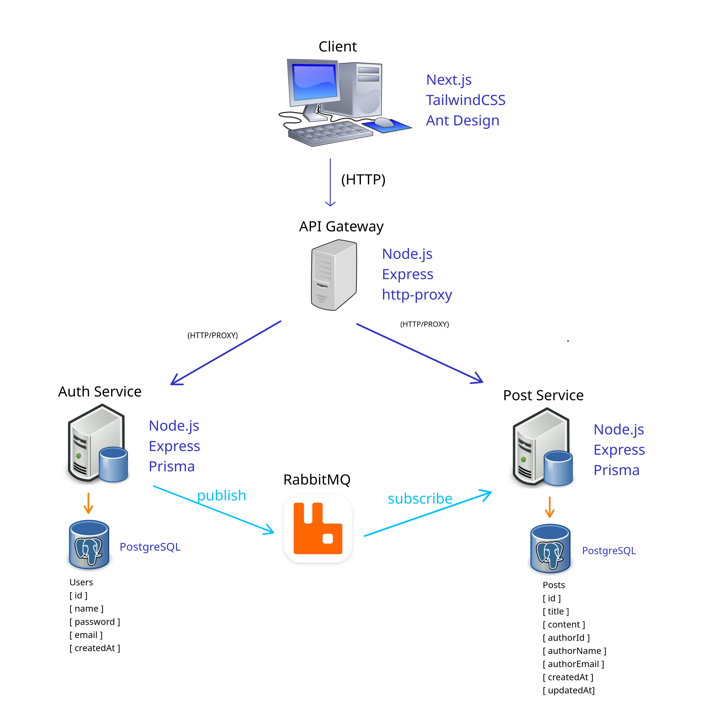

# 🎭 SillyBlog

> **A silly ideas board** - A simple blog platform built with microservices architecture & Next.JS

[](https://microservices.io/)
[](https://nodejs.org/)
[](https://nextjs.org/)
[](https://postgresql.org/)
[](https://docker.com/)

## 📋 About the Project

**SillyBlog** is a modern blog platform built with microservices architecture. The project demonstrates distributed development practices, inter-service communication, event-driven messaging with RabbitMQ, and horizontal scalability.

### 🎯 Current Status: **Production Ready MVP**
- ✅ Complete authentication system with JWT
- ✅ Full post management (CRUD operations)  
- ✅ Modern responsive UI with real-time updates
- ✅ Microservices communication with RabbitMQ
- ✅ Docker containerization and orchestration

---

## 🏗️ Architecture



### Microservices

- **🎨 Client** - Next.js frontend with Ant Design and Tailwind CSS
- **🚪 API Gateway** - Request routing and proxying with JWT middleware
- **🔐 Auth Service** - Authentication, authorization and user management
- **📝 Post Service** - Post CRUD operations and content management
- **🐰 RabbitMQ** - Event-driven messaging between services

### Database

- **PostgreSQL 15** - Two separate instances:
  - `auth-db` (port 5432) - User authentication and profile data
  - `post-db` (port 5433) - Posts and content data

## 🚀 Technologies

### Frontend
- **Next.js 15** - React framework with App Router
- **Ant Design 5** - UI component system
- **Tailwind CSS 4** - Utility-first CSS framework
- **TypeScript** - Static typing

### Backend
- **Node.js** - JavaScript runtime
- **Express.js** - Web framework
- **Prisma** - Database ORM
- **JWT** - Token-based authentication

### Infrastructure
- **Docker & Docker Compose** - Containerization and orchestration
- **PostgreSQL 15** - Relational database
- **RabbitMQ** - Message broker for event-driven communication

## 📦 Prerequisites

- **Docker** >= 20.0
- **Docker Compose** >= 2.0
- **Node.js** >= 18.0 
- **npm**

## 🛠️ Installation and Execution

### Complete Execution with Docker

```bash
# Clone the repository
git clone https://github.com/sillyveira/sillyblog.git
cd sillyblog

# Run all services
docker compose up

# Access the application at http://localhost:2999
```

### Service Ports

- **Client (Frontend)**: `http://localhost:2999`
- **API Gateway**: `http://localhost:8080` 
- **Auth Service**: `http://localhost:3000` (internal)
- **Post Service**: `http://localhost:3001` (internal)
- **RabbitMQ Management**: `http://localhost:15672` (guest/guest)
- **Auth Database**: `localhost:5432`
- **Post Database**: `localhost:5433`


## 📁 Project Structure

```
sillyblog/
├── 📱 client/                    # Next.js Frontend
│   ├── src/app/
│   ├── package.json
│   └── README.md
├── 🚪 apiGateway-service/        # API Gateway
│   ├── routes/
│   ├── middleware/
│   └── package.json
├── 🔐 auth-service/              # Authentication Service
│   ├── src/
│   ├── prisma/
│   └── package.json
├── 📝 post-service/              # Posts Service
│   ├── src/
│   ├── prisma/
│   └── package.json
├── � docs/                      # Documentation
│   ├── architecture.md
│   └── services.md
├── 🐳 docker-compose.yml         # Container orchestration
└── 📖 README.md                  # This file
```

## 🎯 Features

### ✅ Implemented Features

#### 🔐 Authentication System
- User registration and login with validation
- JWT-based authentication with HTTP-only cookies
- Protected routes and middleware
- User profile management and editing
- Automatic token refresh on profile updates

#### 📝 Post Management
- Create, read, update, delete posts
- Markdown editor with real-time preview
- Post pagination and navigation
- Author information display
- Responsive post cards

#### 🎨 User Interface  
- Modern responsive design
- Ant Design component system
- Tailwind CSS styling
- Loading states and skeletons
- Form validation and error handling
- Real-time user feedback

#### 🐰 Event-Driven Architecture
- RabbitMQ message broker integration
- User update events between services
- Automatic author name synchronization
- Fault-tolerant messaging

### 🔄 In Development
- Advanced post filtering and search
- User avatar uploads

### 📋 Planned
- Comment system on posts
- Real-time notifications
- User roles and permissions
- Post categories and tags
- Email notifications
- Social features (likes, shares)

## 📚 Documentation

- [Architecture](./docs/architecture.md)
- [Services](./docs/services.md)
- [Client README](./client/README.md)

## 💡 Inspiration

This project was created to demonstrate my skills in:
- Practical microservices architecture
- Integration between different technologies
- Development best practices
- Containerization and orchestration

## 🚧 Development Status

- ✅ **Auth Service** – Complete with JWT and user management
- ✅ **API Gateway** – Complete with routing and middleware
- ✅ **Post Service** – Complete with CRUD and event messaging
- ✅ **Client (Next.js)** – Complete MVP with all core features
- ✅ **RabbitMQ Integration** – Event-driven user updates
- ✅ **Docker Environment** – Production-ready containerization
- ⏳ **Advanced Features** – Search, categories, comments (planned)
