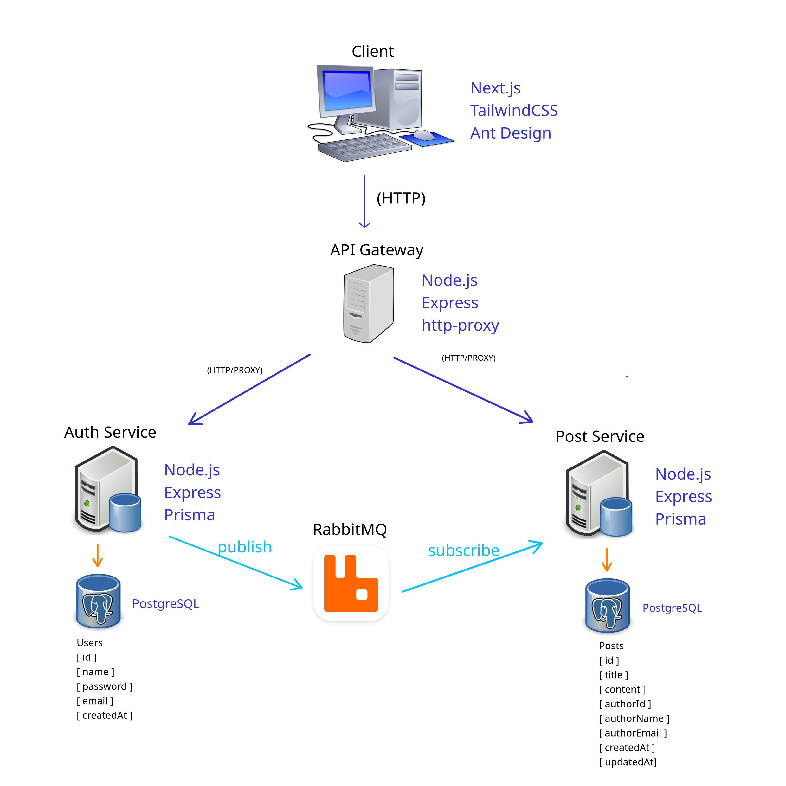

# 🏗️ Architecture Overview

This project is a modern blog platform built using a microservices architecture with Node.js and Next.js.  
The goal is to demonstrate decoupled service design, inter-service communication, event-driven messaging, and horizontal scalability.

## 🎯 Current Status: Production Ready MVP

The SillyBlog platform is a complete, production-ready blog system featuring:
- Full authentication and authorization
- Complete post management (CRUD operations)
- Modern responsive frontend
- Event-driven microservices communication
- Containerized deployment

## 🏗️ System Architecture

### Microservices Overview




## 🔧 Service Details

### 1. 🎨 Frontend (Next.js Client)
**Technology Stack:**
- Next.js 15.4.5 with App Router
- React 19.1.0
- Ant Design 5.26.7 (UI Components)
- Tailwind CSS 4.0 (Styling)
- TypeScript

**Key Features:**
- Server-side rendering and static generation
- Responsive design with mobile-first approach
- Real-time UI updates via React Context
- Form validation and error handling
- Markdown editor with live preview

**Responsibilities:**
- User interface rendering
- Client-side state management
- API communication via custom HTTP client
- User authentication state management
- Route protection and navigation

### 2. 🚪 API Gateway
**Technology Stack:**
- Express.js
- JWT middleware for authentication
- HTTP proxy for service routing

**Key Features:**
- Centralized request routing
- Authentication middleware
- Service discovery and load balancing
- Request/response transformation

**Responsibilities:**
- Route incoming requests to appropriate services
- JWT token validation and user authentication
- Cross-cutting concerns (logging, CORS, rate limiting)
- Service abstraction for frontend

**Routes:**
```
/api/auth/*    → Auth Service (Port 3000)
/api/posts/*   → Post Service (Port 3001)
```

### 3. 🔐 Auth Service
**Technology Stack:**
- Express.js
- Prisma ORM
- PostgreSQL
- JWT (JSON Web Tokens)
- bcrypt for password hashing
- RabbitMQ for event publishing

**Key Features:**
- User registration and authentication
- JWT token generation and validation
- Password hashing and security
- User profile management
- Event-driven user updates

**Responsibilities:**
- User registration with validation
- Login/logout functionality
- JWT token management (creation, refresh)
- User profile CRUD operations
- Publishing user update events to RabbitMQ

**Database Schema:**
```sql
User {
  id        String   @id @default(cuid())
  email     String   @unique
  name      String
  password  String
  createdAt DateTime @default(now())
  updatedAt DateTime @updatedAt
}
```

### 4. 📝 Post Service
**Technology Stack:**
- Express.js
- Prisma ORM
- PostgreSQL
- RabbitMQ for event consumption
- JWT validation

**Key Features:**
- Complete post CRUD operations
- Author information management
- Post pagination and filtering
- Event-driven author name synchronization

**Responsibilities:**
- Post creation, reading, updating, deletion
- Post content management (Markdown support)
- Author information display and updates
- Consuming user update events from RabbitMQ
- Database operations for post data

**Database Schema:**
```sql
Post {
  id          String   @id @default(cuid())
  title       String
  content     String
  authorId    String
  authorName  String
  createdAt   DateTime @default(now())
  updatedAt   DateTime @updatedAt
}
```

### 5. 🐰 RabbitMQ Message Broker
**Technology Stack:**
- RabbitMQ server
- Management UI (Port 15672)
- AMQP protocol

**Key Features:**
- Event-driven messaging between services
- Reliable message delivery
- Queue management and persistence
- Dead letter queues for error handling

**Responsibilities:**
- Facilitate communication between Auth and Post services
- Handle user update events (name changes)
- Ensure eventual consistency across services
- Provide fault tolerance and retry mechanisms

**Message Flow:**
```
Auth Service → [user.updated] → RabbitMQ → Post Service
```

### 6. 🗃️ Database Layer
**Technology Stack:**
- PostgreSQL 15
- Prisma ORM for database access
- Database migrations and seeding

**Database Architecture:**
- **Auth Database (Port 5432):** User authentication and profile data
- **Post Database (Port 5433):** Posts and content management data

**Key Features:**
- Separate databases for service isolation
- Prisma schema-first approach
- Automated migrations
- Database seeding for development

## 🔄 Communication Patterns

### 1. Synchronous Communication
- **Frontend ↔ API Gateway:** HTTP/REST API calls
- **API Gateway ↔ Services:** HTTP proxy with JWT validation
- **Services ↔ Databases:** Prisma ORM queries

### 2. Asynchronous Communication
- **Auth Service → Post Service:** RabbitMQ events for user updates
- **Event Types:**
  - `user.updated`: When user profile changes (name updates)

### 3. Authentication Flow
```
1. User submits credentials → Frontend
2. Frontend → API Gateway → Auth Service
3. Auth Service validates and returns JWT
4. JWT stored in HTTP-only cookies
5. Subsequent requests include JWT for validation
6. API Gateway validates JWT before routing
```

### 4. Post Management Flow
```
1. User creates/edits post → Frontend
2. Frontend → API Gateway → Post Service
3. Post Service validates JWT and processes request
4. Database updated via Prisma ORM
5. Response sent back through the chain
```

### 5. User Update Flow (Event-Driven)
```
1. User updates profile → Auth Service
2. Auth Service updates database
3. Auth Service publishes 'user.updated' event → RabbitMQ
4. Post Service consumes event
5. Post Service updates author names in posts
6. Both services maintain consistency
```

## 🐳 Deployment Architecture

### Docker Containerization
Each service runs in its own Docker container:

```yaml
services:
  client:          # Next.js Frontend
  api-gateway:     # Express.js Gateway
  auth-service:    # Authentication Service
  post-service:    # Post Management Service
  auth-db:         # PostgreSQL (Auth)
  post-db:         # PostgreSQL (Posts)
  rabbitmq:        # Message Broker
```

### Service Dependencies
```
client → api-gateway → {auth-service, post-service}
auth-service → {auth-db, rabbitmq}
post-service → {post-db, rabbitmq}
```

## 🔧 Development Workflow

### Local Development
1. **Individual Service Development:** Each service can be developed independently
2. **Database Migrations:** Prisma handles schema changes and migrations
3. **Message Testing:** RabbitMQ management UI for monitoring events
4. **API Testing:** Services expose REST endpoints for testing

### Production Deployment
1. **Container Orchestration:** Docker Compose for multi-service deployment
2. **Environment Configuration:** Environment variables for different stages
3. **Health Checks:** Each service implements health check endpoints
4. **Logging:** Centralized logging across all services

## 🚀 Scalability Considerations

### Horizontal Scaling
- **Frontend:** Can be deployed to CDN (Vercel, Netlify)
- **API Gateway:** Load balancer can distribute requests
- **Services:** Multiple instances behind load balancer
- **Databases:** Read replicas and connection pooling

### Performance Optimizations
- **Caching:** Redis can be added for session and data caching
- **CDN:** Static assets served via CDN
- **Database Indexing:** Optimized queries with proper indexes
- **Message Queuing:** RabbitMQ clustering for high availability

## 🔮 Future Enhancements

### Planned Features
- **Notification Service:** Real-time notifications
- **Media Service:** Image and file upload handling
- **Analytics Service:** User behavior and post analytics

### Infrastructure Improvements
- **Monitoring:** Prometheus and Grafana for observability
- **CI/CD:** Automated testing and deployment pipelines
